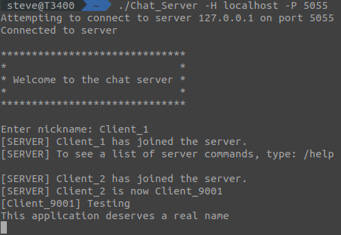
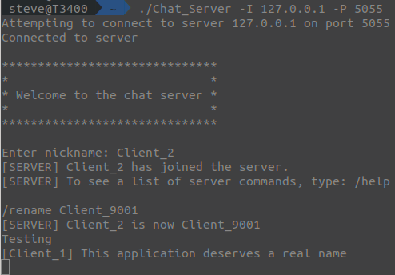
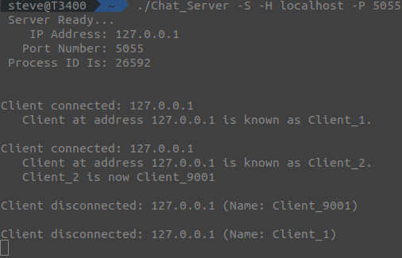

# Chat Server
Chat Server as a multi-threaded, command-line application that depending on the switches passed, will run as either a chat server or a chat client.  Due to the fact that all communications are passed in **PLAIN TEXT** its not recommended for use outside of a trusted network.

Chat Server has only been tested on Linux.


### Usage
```
Usage: ./Chat_Server [OPTION]
  -S, --server              Start as server (default is client)
  -I, --ip                  IP address to use as server, or connect to as client
  -H, --hostname            Hostname to use as server, or connect to as client
  -P, --port                Port numberto use as server, or connect to as client
  -h, --help                Print this help text and exit
```


### Chat Commands
```
Server Commands:
  /w       <name> <message>   Send whisper
  /r                          Reply to whisper
  /who                        Show active clients
  /rename  <name>             Change nickname
  /help                       Shows this message
  /quit                       Quit chatroom
```

### Client Screenshots



### Server Screenshot

